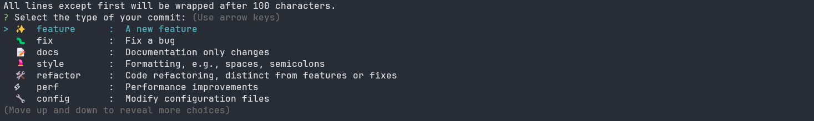

# 📝 Commit Convention Template

A simple and flexible commit message convention setup using **Commitizen** and **Commitlint**, compatible with any front-end package manager (npm, yarn, pnpm, bun).

---

## 🎬 Commitizen Interactive Prompt



## 📦 Features

- ✅ Enforces clean and consistent commit messages
- ✅ Interactive commit prompts via Commitizen
- ✅ Fully customizable commit types and scopes
- ✅ Tool-agnostic: works with **npm**, **yarn**, **pnpm**, and **bun**
- ✅ Easily extendable and CI-friendly

---

## 🚀 Quick Start

### 1. Install dependencies (dev)

📦 Select your package manager

#### bun

```bash
bun install
```

#### npm

```bash
npm install
```

#### pnpm

```bash
pnpm install
```

#### yarn

```bash
yarn install
```
